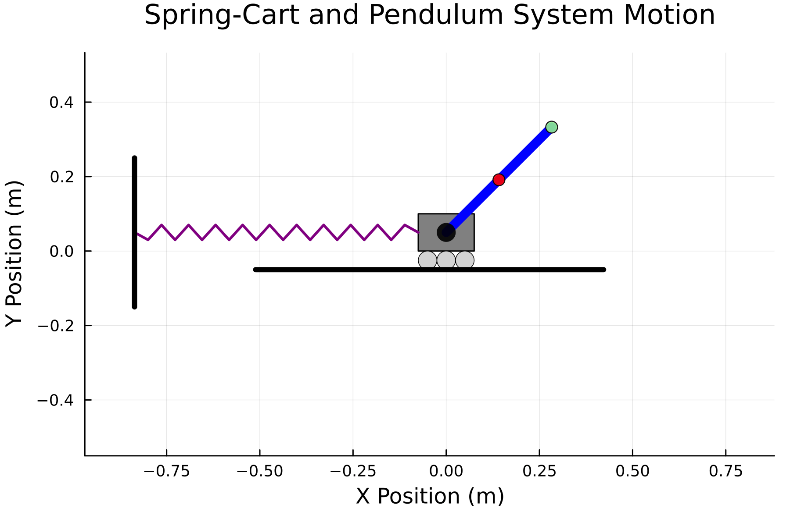
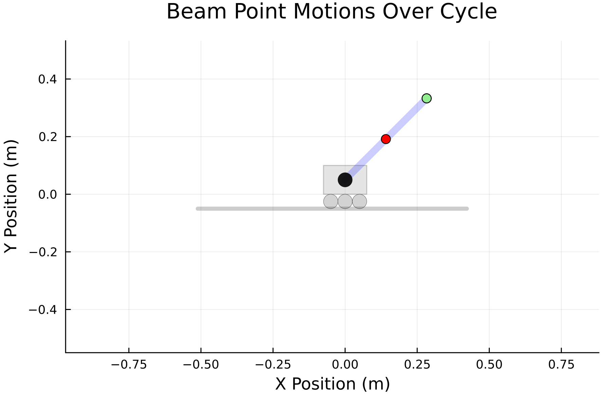

# Project 3 Group 2 - Multibody Dynamics Modeling 

The goal of this project is to model a rigid bar that is connected to a sliding block along a
horizontal tracks. The sliding block is connected to a spring that stretches and compresses.
We determine constraint equations, create an augmented solution method for two moving parts and 
animate the motion of the system. 

## Animations ftw

